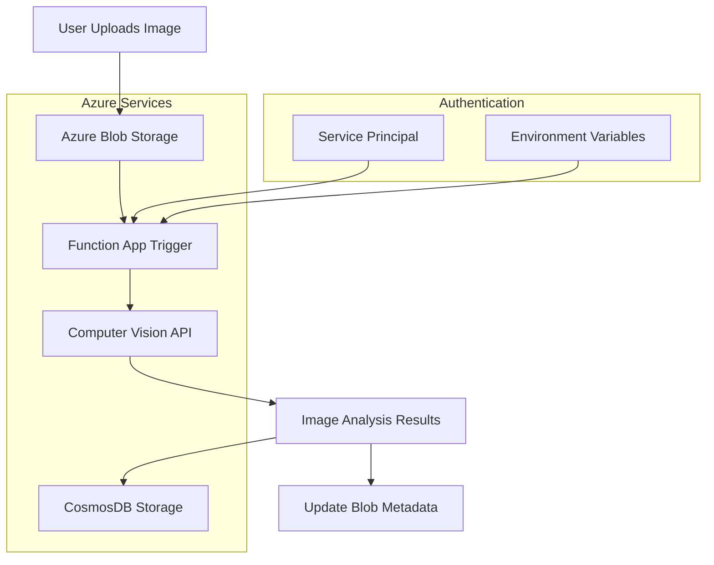

# Serverless AI Image Processor

Cloud-native image processing service leveraging Azure Computer Vision API, CosmosDB, and serverless architecture. Built with .NET 9, Terraform IaC, and GitHub Actions CI/CD. Implements event-driven processing, automated scaling, and enterprise security patterns.

## Architecture



## Technologies

- **Azure**: Blob Storage, Functions, CosmosDB, Computer Vision
- **Infrastructure**: Terraform (modular)
- **Runtime**: .NET 9 Function App (isolated worker)
- **Security**: Service Principal authentication
- **CI/CD**: GitHub Actions

## Quick Start

### 1. Deploy Infrastructure

**Via GitHub Actions (Recommended):**
1. Configure repository secrets: `AZURE_CREDENTIALS` and `TF_BACKEND_CONFIG`
2. Add environment variables to `dev` environment
3. Go to Actions → "Terraform Deploy" → Run workflow

**Via Local:**
```bash
cd terraform
terraform init
terraform apply -var-file="envs/dev/terraform.tfvars"
```

### 2. Deploy Function App

**Via GitHub Actions:**
1. Get Function App publish profile from Azure Portal
2. Add `FUNCTION_PUBLISH_PROFILE` to `dev` environment secrets
3. Go to Actions → "Deploy Azure Function" → Run workflow

**Via Local:**
```bash
cd src/AiImageProcessor
func azure functionapp publish <function-app-name>
```

### 3. Test

Upload an image to the `images` container in your storage account.

## Configuration

### Required GitHub Secrets

| Secret | Type | Description |
|--------|------|-------------|
| `AZURE_CREDENTIALS` | Repository | Service Principal JSON |
| `TF_BACKEND_CONFIG` | Repository | Terraform backend config |
| `FUNCTION_PUBLISH_PROFILE` | Environment | Function App publish profile |

### Required Environment Variables

| Variable | Description |
|----------|-------------|
| `SUBSCRIPTION_ID` | Azure subscription ID |
| `PROJECT_NAME` | Project name for resource naming |
| `LOCATION` | Azure region |
| `STORAGE_TIER` | Storage account tier |
| `STORAGE_REPLICATION_TYPE` | Storage replication type |
| `STORAGE_ENABLE_VERSIONING` | Enable blob versioning |
| `COGNITIVE_SERVICES_SKU` | Cognitive Services SKU |
| `FUNCTION_APP_SKU_TIER` | Function App SKU tier |
| `FUNCTION_APP_SKU_SIZE` | Function App SKU size |
| `MAX_RETRIES` | Maximum retries for operations |
| `TAGS_PROJECT` | Project tag value |
| `TAGS_MANAGED_BY` | ManagedBy tag value |
| `TAGS_OWNER` | Owner tag value |
| `TAGS_COST_CENTER` | CostCenter tag value |

## Project Structure

```
├── terraform/              # Infrastructure as Code
│   ├── modules/           # Reusable modules
│   └── envs/             # Environment configs
├── src/AiImageProcessor/  # .NET Function App
│   ├── Services/         # Business logic
│   ├── Database/         # Data access
│   └── Configuration/    # App settings
└── .github/workflows/    # CI/CD
```

## Development

```bash
# Local development
cd src/AiImageProcessor
func start

# Build
dotnet build

# Deploy
func azure functionapp publish <name>
```

## Workflows

- **Terraform Deploy**: Deploy infrastructure
- **Terraform Destroy**: Remove infrastructure  
- **Deploy Azure Function**: Deploy function code only

## License

MIT License - see [LICENSE](LICENSE) file.